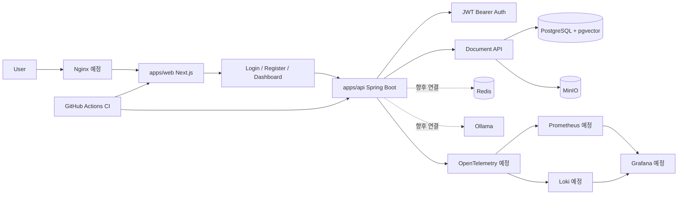

# Architecture

이 문서는 `AssistOps Free`의 목표 아키텍처를 정리합니다. 현재 구현된 영역은 `apps/web` 프론트엔드, `apps/api` Spring Boot API, Docker Compose 기반 로컬 인프라 실행 구성, Spring Boot API와 PostgreSQL 연결, JWT Bearer Auth API, Frontend Auth UI, Dashboard 초기 화면, Workspace 목록 조회, Document Upload UI, Document API, MinIO object storage, PostgreSQL document metadata입니다. Redis와 Ollama는 아직 애플리케이션 코드와 연결하지 않았습니다.

## 현재 단계

- `apps/web`: Next.js App Router 기반 프론트엔드, 로그인/회원가입/dashboard/documents 화면 사용 중
- `apps/api`: Spring Boot API, PostgreSQL persistence foundation, JWT 인증, Document API 구성
- Docker Compose: PostgreSQL + pgvector, Redis, MinIO, Ollama 로컬 실행 구성
- PostgreSQL: Flyway migration, JPA `Workspace`, `User`, `WorkspaceMember`, `Document` entity 구성
- MinIO: 원본 문서 object storage로 연결, 개발용 bucket 자동 초기화 구성
- Auth: Spring Security, JWT access token JSON body 발급, Authorization Bearer header 인증, BCrypt password hashing, `/api/auth/register`, `/api/auth/login`, `/api/auth/me` 구성
- Frontend Auth: browser cookie token storage, cookie에서 accessToken을 읽어 Authorization header를 붙이는 fetch API client, TanStack Query, Zustand auth store, AuthGuard 구성
- Document UI: 문서 업로드, 목록 조회, 다운로드, 삭제 화면 구성
- RBAC: `workspace_members` 테이블 기반 역할 골격 구성. 세부 policy와 사용자별 workspace filtering은 예정
- 루트 workspace: `apps/web` 등록
- 문서화: 목표 아키텍처와 로드맵 작성 중

## 목표 아키텍처

## 구성 요소

| 구성 요소 | 역할 | 현재 상태 |
| --- | --- | --- |
| `apps/web` | Next.js App Router 기반 프론트엔드, auth UI, dashboard, documents 화면 | 사용 중 |
| `apps/api` | Spring Boot 기반 백엔드 API, health API, auth API, workspace 조회 API, document API | 사용 중 |
| Frontend Auth UI | 로그인, 회원가입, 로그아웃, 현재 사용자 조회, dashboard 접근 보호 | 사용 중 |
| Document Upload UI | 문서 업로드, 목록, 다운로드, 삭제 | 사용 중 |
| TanStack Query + Zustand | API 요청 상태와 사용자 인증 상태 관리 | 사용 중 |
| PostgreSQL + pgvector | 업무 데이터와 문서 메타데이터 저장 기반. 벡터 임베딩 저장은 예정 | 로컬 인프라 구성 및 API 연결 |
| Spring Security + JWT | stateless 인증과 API 보호 | 사용 중 |
| Workspace membership | workspace 단위 권한 모델 기반 | 기반 구성 |
| Redis | 캐시, 세션, 비동기 작업 보조 저장소 | 로컬 인프라 구성, 앱 미연동 |
| MinIO | 업로드 문서와 파일 객체 저장 | 사용 중 |
| Ollama | 로컬 LLM 실행 및 추론 | 로컬 인프라 구성, 앱 미연동 |
| Docker Compose | 로컬 통합 실행 환경 | 사용 중 |
| Nginx | reverse proxy 및 정적 자원 서빙 | 예정 |
| GitHub Actions | 프론트엔드 lint/build CI, API test/build CI | 사용 중 |
| OpenTelemetry | trace, metric, log 수집 표준화 | 예정 |
| Prometheus | metric 저장 및 조회 | 예정 |
| Grafana | dashboard 및 시각화 | 예정 |
| Loki | log 수집 및 조회 | 예정 |

## 요청 흐름 목표

1. 사용자는 `apps/web`에서 업무 자동화 기능을 사용합니다.
2. 프론트엔드는 `apps/api`의 REST API를 호출합니다.
3. 백엔드는 인증, 권한, 문서, 워크플로우, AI 요청을 처리합니다.
4. 문서 파일은 MinIO에 저장하고, 메타데이터는 PostgreSQL에 저장합니다.
5. 향후 문서 텍스트를 추출하고 chunking 후 임베딩을 pgvector에 저장합니다.
6. RAG 요청은 PostgreSQL + pgvector 검색 결과와 Ollama 로컬 LLM을 조합해 처리합니다.
7. 시스템 지표, 로그, trace는 OpenTelemetry 기반으로 수집하고 Prometheus, Loki, Grafana로 확인합니다.

## Local Infrastructure

현재 Docker Compose로 실행할 수 있는 로컬 인프라 서비스는 다음과 같습니다.

| 서비스 | 포트 | 현재 연결 상태 |
| --- | --- | --- |
| PostgreSQL + pgvector | `15432` | Spring Boot datasource, Flyway, JPA 연결. Docker named volume 사용 |
| Redis | `6379` | Spring Boot와 미연결 |
| MinIO API | `9000` | Spring Boot Document API와 연결 |
| MinIO Console | `9001` | 개발 중 bucket/object 확인 |
| Ollama | `11434` | Spring Boot와 미연결 |

현재 단계는 PostgreSQL 연결, JPA/Flyway 영속성 골격, JWT Bearer 인증 기반, workspace membership 기반 권한 골격, 프론트엔드 인증 화면, dashboard 초기 화면, 문서 업로드 및 원본 저장까지 다룹니다. Redis client, Spring AI, Ollama API 호출은 아직 추가하지 않았습니다.

## 현재 문서 저장 흐름

1. 인증된 사용자가 `/documents`에서 PDF, TXT, MD 파일을 업로드합니다.
2. 프론트엔드는 multipart/form-data로 `POST /api/documents`를 호출합니다.
3. 백엔드는 파일 타입과 10MB 크기 제한을 검증합니다.
4. 원본 파일은 MinIO bucket `assistops-documents`에 UUID 기반 object key로 저장합니다.
5. PostgreSQL `documents` 테이블에는 workspace, 업로드 사용자, 원본 파일명, object key, content type, 크기, 상태를 저장합니다.
6. 목록/상세/다운로드/삭제 API는 사용자가 속한 workspace 문서에 대해서만 동작합니다.

현재 단계에서는 문서 텍스트 추출, chunking, embedding, pgvector similarity search, RAG answer generation을 수행하지 않습니다.

## 현재 인증 흐름

1. `POST /api/auth/register` 또는 `POST /api/auth/login` 성공 시 백엔드가 JWT accessToken을 JSON response body로 반환합니다.
2. 프론트엔드는 accessToken을 `localStorage`가 아니라 `assistops_access_token` browser cookie에 저장합니다.
3. 프론트엔드 API client는 요청마다 cookie에서 accessToken을 읽고 `Authorization: Bearer <token>` header를 추가합니다.
4. 백엔드는 `Authorization` header의 Bearer token을 검증해 현재 사용자를 인증합니다.
5. dashboard 새로고침 시 프론트엔드는 cookie token으로 `GET /api/auth/me`를 호출해 사용자 상태를 복원합니다.

이 cookie는 JavaScript가 읽고 쓰는 cookie이므로 `HttpOnly`가 아닙니다. HttpOnly Cookie 방식, BFF 인증 구조, refresh token, XSS/CSRF 보안 강화는 후속 개선 영역입니다.

PostgreSQL은 Docker named volume에 데이터를 저장합니다. 개발 중 `POSTGRES_USER`, `POSTGRES_DB` 같은 초기화 값을 변경한 경우 기존 volume에는 자동 반영되지 않으므로, 로컬 데이터 삭제가 가능한 상황에서만 `pnpm infra:reset`으로 volume을 재초기화합니다.

## 구현 상태 구분

현재 이 문서는 목표 아키텍처를 설명합니다. 실제 구현 완료로 볼 수 있는 범위는 Next.js 프론트엔드, Spring Boot API, health API, JWT Auth API, 프론트엔드 로그인/회원가입/dashboard/documents 화면, 인증이 필요한 workspace 조회 API, 문서 업로드/목록/상세/다운로드/삭제 API, PostgreSQL 연결, Flyway migration, JPA entity, workspace membership foundation, MinIO 원본 파일 저장, 프론트엔드 Web CI, API CI, Docker Compose 로컬 인프라 실행 구성까지입니다.

예정 영역은 refresh token, HttpOnly Cookie 또는 BFF 인증 구조 검토, XSS/CSRF 보안 강화, workspace switcher, 사용자별 workspace filtering, 세부 RBAC policy, document parsing, chunking, embedding, pgvector similarity search, RAG answer generation, Ollama integration, workflow builder, Redis session/cache, Monitoring입니다.
