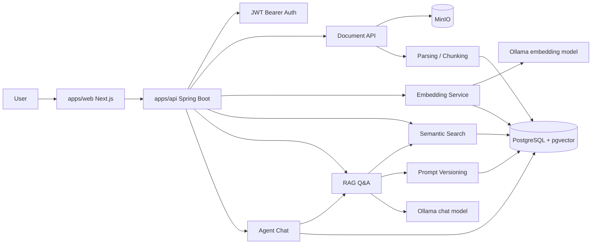

# Architecture

이 문서는 `AI Knowledge Hub`의 현재 구조와 후속 확장 방향을 정리합니다.

## 현재 구현된 영역

- `apps/web`: Next.js App Router 기반 프론트엔드
- `apps/api`: Spring Boot API
- JWT Bearer Auth와 frontend cookie token storage
- 문서 업로드, MinIO 원본 파일 저장, PostgreSQL 문서 메타데이터 저장
- Apache Tika 기반 문서 텍스트 추출
- 문서 chunking과 `document_chunks` 저장
- Ollama embedding model 기반 vector 생성
- pgvector semantic search
- RAG Q&A와 source citation
- Agent Chat session/message history와 streaming response
- Prompt Template/Version 관리와 active prompt 추적
- Querydsl 기반 동적 목록 조회

## 목표 구조

## 데이터와 쿼리 전략

| 방식 | 적용 영역 | 이유 |
| --- | --- | --- |
| Spring Data JPA | 단순 CRUD, ID 조회, 짧은 조건 조회 | 가장 단순한 영속성 경로 |
| Querydsl | 문서 목록, RAG 답변 이력, Agent 세션 목록 | keyword, status, model, 기간, pagination 조건 조합 |
| native SQL/JDBC | pgvector embedding update, similarity search | PostgreSQL/pgvector 특화 연산 처리 |

pgvector similarity search는 Querydsl로 대체하지 않고 native SQL/JDBC 기반을 유지합니다.

## Local Infrastructure

| 서비스 | 포트 | 상태 |
| --- | --- | --- |
| PostgreSQL + pgvector | `15432` | Spring Boot datasource, Flyway, JPA 연결 |
| Redis | `6379` | 로컬 인프라만 구성, 앱 미연동 |
| MinIO API | `9000` | 문서 원본 저장에 사용 |
| MinIO Console | `9001` | 개발 중 object 확인 |
| Ollama | `11434` | embedding/chat model 호출에 사용 |

## 현재 제외된 영역

- Notes, Links, Collections, Knowledge Tags
- Summary generation
- Sharing/permissions 고도화
- Monitoring과 production deployment
- Redis queue 기반 비동기 처리
- WebSocket 기반 realtime 협업

기존 자동화 중심 기능은 제품 범위에서 제외했습니다. 이미 존재하는 migration은 Flyway checksum과 로컬 DB 호환성을 위해 유지하지만, 애플리케이션 API/UI에서는 노출하지 않습니다.
