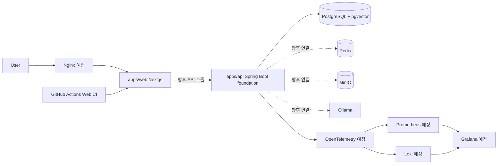

# Architecture

이 문서는 `AssistOps Free`의 목표 아키텍처를 정리합니다. 현재 구현된 영역은 `apps/web` 프론트엔드 기반, `apps/api` Spring Boot API 초기 골격, Docker Compose 기반 로컬 인프라 실행 구성, Spring Boot API와 PostgreSQL 연결 기반입니다. Redis, MinIO, Ollama는 아직 애플리케이션 코드와 연결하지 않았습니다.

## 현재 단계

- `apps/web`: Next.js App Router 기반 프론트엔드 사용 중
- `apps/api`: Spring Boot API와 PostgreSQL persistence foundation 진행 중
- Docker Compose: PostgreSQL + pgvector, Redis, MinIO, Ollama 로컬 실행 구성
- PostgreSQL: Flyway migration, JPA `Workspace` entity, `GET /api/workspaces` 구성
- 루트 workspace: `apps/web` 등록
- 문서화: 목표 아키텍처와 로드맵 작성 중

## 목표 아키텍처

## 구성 요소

| 구성 요소 | 역할 | 현재 상태 |
| --- | --- | --- |
| `apps/web` | Next.js App Router 기반 프론트엔드 | 사용 중 |
| `apps/api` | Spring Boot 기반 백엔드 API, health API, workspace 조회 API | 사용 중 |
| PostgreSQL + pgvector | 업무 데이터와 벡터 임베딩 저장 기반 | 로컬 인프라 구성 및 API 연결 |
| Redis | 캐시, 세션, 비동기 작업 보조 저장소 | 로컬 인프라 구성, 앱 미연동 |
| MinIO | 업로드 문서와 파일 객체 저장 | 로컬 인프라 구성, 앱 미연동 |
| Ollama | 로컬 LLM 실행 및 추론 | 로컬 인프라 구성, 앱 미연동 |
| Docker Compose | 로컬 통합 실행 환경 | 사용 중 |
| Nginx | reverse proxy 및 정적 자원 서빙 | 예정 |
| GitHub Actions | 프론트엔드 lint/build CI, API CI는 향후 확장 | 일부 사용 중 |
| OpenTelemetry | trace, metric, log 수집 표준화 | 예정 |
| Prometheus | metric 저장 및 조회 | 예정 |
| Grafana | dashboard 및 시각화 | 예정 |
| Loki | log 수집 및 조회 | 예정 |

## 요청 흐름 목표

1. 사용자는 `apps/web`에서 업무 자동화 기능을 사용합니다.
2. 프론트엔드는 `apps/api`의 REST API를 호출합니다.
3. 백엔드는 인증, 권한, 문서, 워크플로우, AI 요청을 처리합니다.
4. 문서 파일은 MinIO에 저장하고, 메타데이터는 PostgreSQL에 저장합니다.
5. 문서 임베딩은 로컬 embedding model로 생성하고 pgvector에 저장합니다.
6. RAG 요청은 PostgreSQL + pgvector 검색 결과와 Ollama 로컬 LLM을 조합해 처리합니다.
7. 시스템 지표, 로그, trace는 OpenTelemetry 기반으로 수집하고 Prometheus, Loki, Grafana로 확인합니다.

## Local Infrastructure

현재 Docker Compose로 실행할 수 있는 로컬 인프라 서비스는 다음과 같습니다.

| 서비스 | 포트 | 현재 연결 상태 |
| --- | --- | --- |
| PostgreSQL + pgvector | `5432` | Spring Boot datasource, Flyway, JPA 연결 |
| Redis | `6379` | Spring Boot와 미연결 |
| MinIO API | `9000` | Spring Boot와 미연결 |
| MinIO Console | `9001` | Spring Boot와 미연결 |
| Ollama | `11434` | Spring Boot와 미연결 |

현재 단계는 PostgreSQL 연결과 JPA/Flyway 영속성 골격까지 다룹니다. Redis client, MinIO SDK, Spring AI, Ollama API 호출은 아직 추가하지 않았습니다.

## 구현 상태 구분

현재 이 문서는 목표 아키텍처를 설명합니다. 실제 구현 완료로 볼 수 있는 범위는 Next.js 프론트엔드 기반, Spring Boot API 초기 골격, health API, workspace 조회 API, PostgreSQL 연결, Flyway migration, 프론트엔드 Web CI, Docker Compose 로컬 인프라 실행 구성까지입니다.
