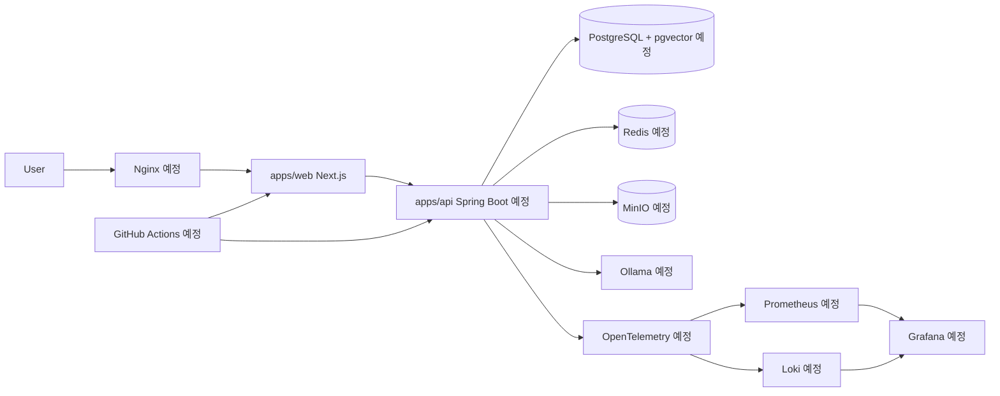

# Architecture

이 문서는 `AssistOps Free`의 목표 아키텍처를 정리합니다. 현재 구현된 영역은 `apps/web` 프론트엔드 기반이며, 백엔드, 인프라, AI, 데이터베이스, 관측성 구성은 향후 구현 예정입니다.

## 현재 단계

- `apps/web`: Next.js App Router 기반 프론트엔드 사용 중
- 루트 workspace: `apps/web` 등록
- 문서화: 목표 아키텍처와 로드맵 작성 중

## 목표 아키텍처

## 구성 요소

| 구성 요소 | 역할 | 현재 상태 |
| --- | --- | --- |
| `apps/web` | Next.js App Router 기반 프론트엔드 | 사용 중 |
| `apps/api` | Spring Boot 기반 백엔드 API | 예정 |
| PostgreSQL + pgvector | 업무 데이터와 벡터 임베딩 저장 | 예정 |
| Redis | 캐시, 세션, 비동기 작업 보조 저장소 | 예정 |
| MinIO | 업로드 문서와 파일 객체 저장 | 예정 |
| Ollama | 로컬 LLM 실행 및 추론 | 예정 |
| Docker Compose | 로컬 통합 실행 환경 | 예정 |
| Nginx | reverse proxy 및 정적 자원 서빙 | 예정 |
| GitHub Actions | lint, test, build 중심 CI | 예정 |
| OpenTelemetry | trace, metric, log 수집 표준화 | 예정 |
| Prometheus | metric 저장 및 조회 | 예정 |
| Grafana | dashboard 및 시각화 | 예정 |
| Loki | log 수집 및 조회 | 예정 |

## 요청 흐름 목표

1. 사용자는 `apps/web`에서 업무 자동화 기능을 사용합니다.
2. 프론트엔드는 `apps/api`의 REST API를 호출합니다.
3. 백엔드는 인증, 권한, 문서, 워크플로우, AI 요청을 처리합니다.
4. 문서 파일은 MinIO에 저장하고, 메타데이터는 PostgreSQL에 저장합니다.
5. 문서 임베딩은 로컬 embedding model로 생성하고 pgvector에 저장합니다.
6. RAG 요청은 PostgreSQL + pgvector 검색 결과와 Ollama 로컬 LLM을 조합해 처리합니다.
7. 시스템 지표, 로그, trace는 OpenTelemetry 기반으로 수집하고 Prometheus, Loki, Grafana로 확인합니다.

## 구현 상태 구분

현재 이 문서는 목표 아키텍처를 설명합니다. 실제 구현 완료로 볼 수 있는 범위는 Next.js 프론트엔드 초기 기반과 루트 workspace 정리까지입니다.
