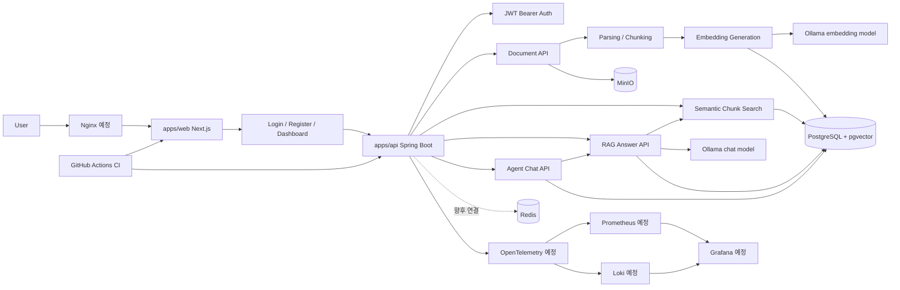

# Architecture

이 문서는 `AssistOps Free`의 목표 아키텍처를 정리합니다. 현재 구현된 영역은 `apps/web` 프론트엔드, `apps/api` Spring Boot API, Docker Compose 기반 로컬 인프라 실행 구성, Spring Boot API와 PostgreSQL 연결, JWT Bearer Auth API, Frontend Auth UI, Dashboard 초기 화면, Workspace 목록 조회, Document Upload UI, Document API, MinIO original file storage, Document Parsing, Document Chunking, Embedding generation, pgvector embedding storage, Semantic chunk search, RAG Answer generation, Source citation, Agent Chat Session, Agent Message History, Agent Chat Streaming Response, Querydsl dynamic list filtering입니다. Redis Pub/Sub과 tool calling은 아직 애플리케이션 코드와 연결하지 않았습니다.

## 현재 단계

- `apps/web`: Next.js App Router 기반 프론트엔드, 로그인/회원가입/dashboard/documents/search/rag/agent 화면 사용 중
- `apps/api`: Spring Boot API, PostgreSQL persistence foundation, JWT 인증, Document API, Document Parsing/Chunking, Embedding/Search, RAG Answer, Agent Chat 구성
- Docker Compose: PostgreSQL + pgvector, Redis, MinIO, Ollama 로컬 실행 구성
- PostgreSQL: Flyway migration, JPA `Workspace`, `User`, `WorkspaceMember`, `Document`, `DocumentChunk` entity 구성
- Querying: 단순 CRUD는 Spring Data JPA, 동적 목록 조회는 Querydsl, pgvector 특화 연산은 native SQL/JDBC로 분리
- MinIO: 원본 문서 object storage로 연결, 개발용 bucket 자동 초기화 구성
- Document Processing: Apache Tika 기반 텍스트 추출, 문자 수 기반 chunking 구성
- Embedding/Search: Spring AI Ollama로 `nomic-embed-text` embedding 생성, pgvector cosine distance 기반 chunk search 구성
- RAG Answer: 검색된 chunk를 context로 prompt를 구성하고 `llama3.2` chat model로 한국어 답변 생성, source citation 저장
- RAG Performance: 단계별 latency 측정, prompt context 길이 제한, Ollama generation option과 keep_alive 적용
- Agent Chat: RAG Answer Service를 재사용해 session, user/assistant message, source citation, latency metrics 저장
- Agent Streaming: Spring MVC `SseEmitter`와 Spring AI Ollama streaming 호출로 assistant token을 `text/event-stream`으로 전송
- Auth: Spring Security, JWT access token JSON body 발급, Authorization Bearer header 인증, BCrypt password hashing, `/api/auth/register`, `/api/auth/login`, `/api/auth/me` 구성
- Frontend Auth: browser cookie token storage, cookie에서 accessToken을 읽어 Authorization header를 붙이는 fetch API client, TanStack Query, Zustand auth store, AuthGuard 구성
- Document UI: 문서 업로드, 목록 조회, 다운로드, 삭제, 처리, embedding 실행 화면 구성
- Search UI: query 입력, topK 설정, semantic chunk search 결과 확인 화면 구성
- RAG UI: 질문 입력, 답변 표시, 출처 chunk 표시, 답변 이력 조회/삭제 구성
- Agent UI: 세션 목록, 메시지 타임라인, assistant streaming 렌더링, 출처와 latency 표시, 세션 삭제 구성
- RBAC: `workspace_members` 테이블 기반 역할 골격 구성. 세부 policy와 사용자별 workspace filtering은 예정
- 루트 workspace: `apps/web` 등록
- 문서화: 목표 아키텍처와 로드맵 작성 중

## 목표 아키텍처

## 구성 요소

| 구성 요소 | 역할 | 현재 상태 |
| --- | --- | --- |
| `apps/web` | Next.js App Router 기반 프론트엔드, auth UI, dashboard, documents, search, rag, agent 화면 | 사용 중 |
| `apps/api` | Spring Boot 기반 백엔드 API, health API, auth API, workspace 조회 API, document API, search API, RAG API, Agent API | 사용 중 |
| Frontend Auth UI | 로그인, 회원가입, 로그아웃, 현재 사용자 조회, dashboard 접근 보호 | 사용 중 |
| Document Upload UI | 문서 업로드, 목록, 다운로드, 삭제 | 사용 중 |
| Document Processing UI | 문서 처리 버튼, 처리 상태, chunk 목록 확인 | 사용 중 |
| Semantic Search UI | query 기반 유사 chunk 검색 결과 확인 | 사용 중 |
| RAG Q&A UI | 문서 근거 기반 질문, 답변, 출처, 이력 조회/삭제 | 사용 중 |
| Agent Chat UI | RAG Answer를 세션형 채팅 UX로 저장하고 streaming 렌더링 | 사용 중 |
| TanStack Query + Zustand | API 요청 상태와 사용자 인증 상태 관리 | 사용 중 |
| PostgreSQL + pgvector | 업무 데이터, 문서 메타데이터, document chunks, embedding vector 저장과 cosine distance 검색 | 사용 중 |
| Querydsl | 문서 목록, RAG 답변 이력, Agent Chat 세션 목록의 동적 검색/필터링/페이징 | 사용 중 |
| Spring Security + JWT | stateless 인증과 API 보호 | 사용 중 |
| Workspace membership | workspace 단위 권한 모델 기반 | 기반 구성 |
| Redis | 캐시, 세션, 비동기 작업 보조 저장소 | 로컬 인프라 구성, 앱 미연동 |
| MinIO | 업로드 문서와 파일 객체 저장 | 사용 중 |
| Apache Tika | PDF/TXT/MD 텍스트 추출 | 사용 중 |
| Spring AI Ollama | 로컬 Ollama embedding/chat model 호출 | 사용 중 |
| Ollama | 로컬 embedding model과 chat model 실행 | 사용 중 |
| Docker Compose | 로컬 통합 실행 환경 | 사용 중 |
| Nginx | reverse proxy 및 정적 자원 서빙 | 예정 |
| GitHub Actions | 프론트엔드 lint/build CI, API test/build CI | 사용 중 |
| OpenTelemetry | trace, metric, log 수집 표준화 | 예정 |
| Prometheus | metric 저장 및 조회 | 예정 |
| Grafana | dashboard 및 시각화 | 예정 |
| Loki | log 수집 및 조회 | 예정 |

## 요청 흐름 목표

1. 사용자는 `apps/web`에서 업무 자동화 기능을 사용합니다.
2. 프론트엔드는 `apps/api`의 REST API를 호출합니다.
3. 백엔드는 인증, 권한, 문서, 워크플로우, AI 요청을 처리합니다.
4. 문서 파일은 MinIO에 저장하고, 메타데이터는 PostgreSQL에 저장합니다.
5. 문서 텍스트를 추출하고 chunking 후 `document_chunks`에 저장합니다.
6. chunk content를 Ollama embedding model로 vector화하고 pgvector `embedding vector(768)` 컬럼에 저장합니다.
7. Semantic search 요청은 query embedding과 pgvector cosine distance로 가까운 chunk를 반환합니다.
8. RAG answer 요청은 semantic search 결과를 context로 묶어 Ollama chat model이 답변을 생성합니다.
9. prompt에는 chunk별 800자, 전체 context 3000자 기본 제한을 적용합니다.
10. 답변과 출처 chunk, latency metrics는 `rag_answers`, `rag_answer_sources`에 저장합니다.
11. Agent Chat non-streaming 요청은 사용자 메시지를 저장한 뒤 기존 RAG Answer Service를 호출하고, assistant 메시지와 출처, latency metrics를 `agent_chat_*` 테이블에 저장합니다.
12. Agent Chat streaming 요청은 USER 메시지를 즉시 저장하고, source/token/latency/done/error 이벤트를 SSE 형식으로 전송한 뒤 ASSISTANT 메시지를 저장합니다.
13. backend log에는 query embedding, vector search, prompt build, chat generation, persist 단계별 latency summary를 남깁니다.
14. 시스템 지표, 로그, trace는 OpenTelemetry 기반으로 수집하고 Prometheus, Loki, Grafana로 확인합니다.

## Local Infrastructure

현재 Docker Compose로 실행할 수 있는 로컬 인프라 서비스는 다음과 같습니다.

| 서비스 | 포트 | 현재 연결 상태 |
| --- | --- | --- |
| PostgreSQL + pgvector | `15432` | Spring Boot datasource, Flyway, JPA 연결. Docker named volume 사용 |
| Redis | `6379` | Spring Boot와 미연결 |
| MinIO API | `9000` | Spring Boot Document API와 연결 |
| MinIO Console | `9001` | 개발 중 bucket/object 확인 |
| Ollama | `11434` | Spring AI embedding/chat 호출에 연결 |

현재 단계는 PostgreSQL 연결, JPA/Flyway 영속성 골격, Querydsl 기반 동적 목록 조회, JWT Bearer 인증 기반, workspace membership 기반 권한 골격, 프론트엔드 인증 화면, dashboard 초기 화면, 문서 업로드 및 원본 저장, 문서 텍스트 추출과 chunk 저장, Ollama embedding 생성, pgvector 유사 chunk 검색, Ollama chat model 기반 RAG 답변 생성, Agent Chat 세션 저장, Agent Chat streaming response까지 다룹니다. Redis client와 queue 기반 비동기 처리는 아직 추가하지 않았습니다.

## 현재 문서 저장 흐름

1. 인증된 사용자가 `/documents`에서 PDF, TXT, MD 파일을 업로드합니다.
2. 프론트엔드는 multipart/form-data로 `POST /api/documents`를 호출합니다.
3. 백엔드는 파일 타입과 10MB 크기 제한을 검증합니다.
4. 원본 파일은 MinIO bucket `assistops-documents`에 UUID 기반 object key로 저장합니다.
5. PostgreSQL `documents` 테이블에는 workspace, 업로드 사용자, 원본 파일명, object key, content type, 크기, 상태를 저장합니다.
6. `POST /api/documents/{id}/process`는 MinIO 원본을 다운로드하고 Apache Tika로 텍스트를 추출합니다.
7. 추출된 텍스트는 기본 1000자 chunk size와 150자 overlap으로 분할해 `document_chunks`에 저장합니다.
8. token count는 tokenizer 기반이 아니라 `content.length / 4` 추정값입니다.
9. `POST /api/documents/{id}/embed`는 `document_chunks.content`를 `nomic-embed-text`로 embedding하고 pgvector 컬럼에 저장합니다.
10. `POST /api/search/chunks`는 query embedding과 cosine distance로 현재 사용자의 workspace chunk를 검색합니다.
11. `POST /api/rag/answer`는 기본 topK 3으로 검색 결과를 가져오고, context를 제한한 prompt를 구성해 `llama3.2`로 답변을 생성합니다.
12. Ollama chat 호출에는 `num_predict=256`, `temperature=0.2`, `top_p=0.9`, `keep_alive=30m` 기본값을 적용합니다.
13. 답변과 출처, latency metrics는 `rag_answers`, `rag_answer_sources`에 저장하고 `/rag`에서 조회/삭제합니다.
14. `/api/agent/sessions/{id}/messages`는 USER 메시지를 저장하고 기존 RAG Answer Service로 ASSISTANT 답변을 생성한 뒤, 출처와 latency 핵심 지표를 메시지에 연결합니다.
15. `/api/agent/sessions/{id}/messages/stream`은 같은 흐름을 SSE/fetch stream으로 제공하며, event type은 `metadata`, `source`, `token`, `latency`, `done`, `error`입니다.
16. 목록/상세/다운로드/삭제/처리/chunk 조회/embedding/search/RAG/Agent API는 사용자가 속한 workspace 또는 본인 session에 대해서만 동작합니다.
17. 문서 목록, RAG 답변 이력, Agent Chat 세션 목록은 Querydsl로 keyword/status/model/date/page/size 조건을 조합합니다.

## 데이터 조회 전략

| 조회 방식 | 적용 영역 | 이유 |
| --- | --- | --- |
| Spring Data JPA Repository | 단순 저장, 삭제, ID 조회, 짧은 조건 조회 | 가장 단순하고 충분한 CRUD 경로 |
| Querydsl | 문서 목록, RAG 답변 이력, Agent Chat 세션 목록 | keyword, status, 기간, pagination 같은 동적 조건을 타입 안전하게 조합 |
| native SQL/JDBC | `document_chunks.embedding` update, pgvector cosine distance search | pgvector operator와 vector literal처럼 PostgreSQL 특화 기능이 필요 |

pgvector similarity search는 Querydsl로 억지 추상화하지 않고 native SQL/JDBC 기반을 유지합니다. Querydsl은 우선 화면 목록 조회와 필터링에만 적용합니다.

현재 단계에서는 WebSocket, Redis Pub/Sub, multi-turn context memory, tool calling, prompt versioning UI, workflow automation, release copilot을 수행하지 않습니다.

## 현재 인증 흐름

1. `POST /api/auth/register` 또는 `POST /api/auth/login` 성공 시 백엔드가 JWT accessToken을 JSON response body로 반환합니다.
2. 프론트엔드는 accessToken을 `localStorage`가 아니라 `assistops_access_token` browser cookie에 저장합니다.
3. 프론트엔드 API client는 요청마다 cookie에서 accessToken을 읽고 `Authorization: Bearer <token>` header를 추가합니다.
4. 백엔드는 `Authorization` header의 Bearer token을 검증해 현재 사용자를 인증합니다.
5. dashboard 새로고침 시 프론트엔드는 cookie token으로 `GET /api/auth/me`를 호출해 사용자 상태를 복원합니다.

이 cookie는 JavaScript가 읽고 쓰는 cookie이므로 `HttpOnly`가 아닙니다. HttpOnly Cookie 방식, BFF 인증 구조, refresh token, XSS/CSRF 보안 강화는 후속 개선 영역입니다.

PostgreSQL은 Docker named volume에 데이터를 저장합니다. 개발 중 `POSTGRES_USER`, `POSTGRES_DB` 같은 초기화 값을 변경한 경우 기존 volume에는 자동 반영되지 않으므로, 로컬 데이터 삭제가 가능한 상황에서만 `pnpm infra:reset`으로 volume을 재초기화합니다.

## 구현 상태 구분

현재 이 문서는 목표 아키텍처를 설명합니다. 실제 구현 완료로 볼 수 있는 범위는 Next.js 프론트엔드, Spring Boot API, health API, JWT Auth API, 프론트엔드 로그인/회원가입/dashboard/documents/search/rag/agent 화면, 인증이 필요한 workspace 조회 API, 문서 업로드/목록/상세/다운로드/삭제/처리/chunk 조회/embedding/search/RAG answer/Agent Chat API, Agent Chat streaming API, Querydsl 기반 동적 목록 조회, PostgreSQL 연결, Flyway migration, JPA entity, workspace membership foundation, MinIO 원본 파일 저장, Apache Tika 텍스트 추출, document chunk 저장, Spring AI Ollama embedding/chat 호출, pgvector embedding 저장과 유사 chunk 검색, source citation, RAG answer history 저장, Agent Chat session/message history 저장, RAG latency metrics, prompt context 제한, Ollama generation option 적용, 프론트엔드 Web CI, API CI, Docker Compose 로컬 인프라 실행 구성까지입니다.

예정 영역은 refresh token, HttpOnly Cookie 또는 BFF 인증 구조 검토, XSS/CSRF 보안 강화, workspace switcher, 사용자별 workspace filtering, 세부 RBAC policy, WebSocket, Redis Pub/Sub, multi-turn context memory, tool calling, prompt versioning UI, workflow automation, release copilot, Redis session/cache/queue, Monitoring입니다.
